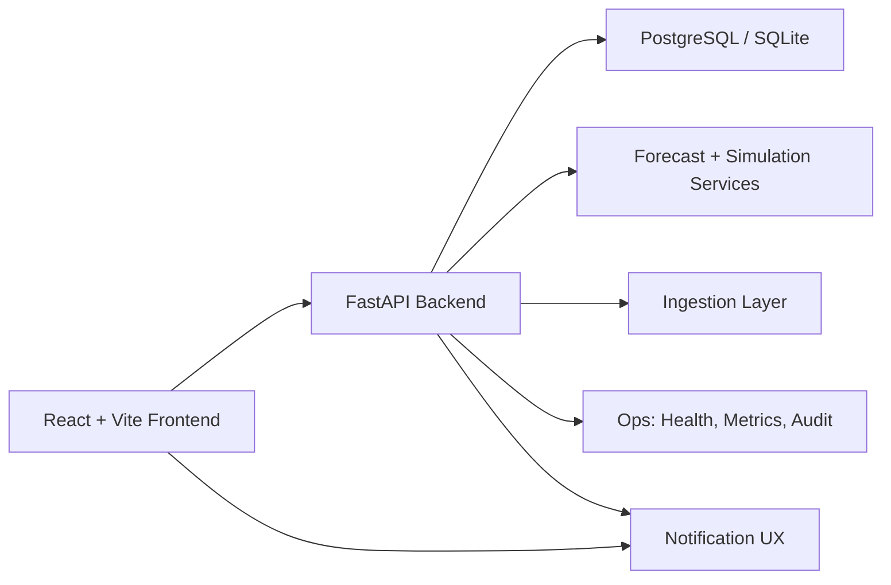

# PaintFlow.ai

PaintFlow.ai is a full-stack, role-based paint supply-chain platform with three portals:
- Admin (manufacturer control tower)
- Dealer (procurement + fulfillment workspace)
- Customer (shade discovery + order request flow)

It includes authentication, dashboards, forecasting, simulations, notifications, ingestion APIs, and CRUD surfaces for operational data.

## Access URLs

### Current Public Demo URL (Live now)
- Main public URL: [https://cent-mins-preventing-tracker.trycloudflare.com](https://cent-mins-preventing-tracker.trycloudflare.com)
- Short URL: [https://hosturl.info/O7qC19](https://hosturl.info/O7qC19) (redirects to the main URL)

Note:
- This is a Cloudflare quick-tunnel link, so it is temporary and can change after restart.

### Local (Docker)
- Frontend: `http://localhost:5173`
- Backend API: `http://localhost:8000`
- Swagger: `http://localhost:8000/docs`

### Public (quick tunnel)
Run:

```bash
./scripts/start_public_url.sh
./scripts/public_url_status.sh
```

The live URL is written to `.runtime/public_url.txt` (Cloudflare quick tunnel, temporary URL).

## Demo Credentials (Seeded)

These are the seeded accounts from `backend/seed/generate_data.py`:

| Role | Email | Password |
|---|---|---|
| Admin | `admin@paintflow.ai` | `admin123` |
| Dealer | `dealer1@paintflow.ai` | `dealer123` |
| Customer | `rahul@example.com` | `customer123` |

Notes:
- Login is role-safe. A user only enters their own dashboard.
- Route `/app` auto-redirects to role home (`/admin`, `/dealer`, `/customer`).

## Architecture



### High-level modules
- `backend/app/routers/*`: auth, admin, dealer, customer, notifications, ingestion, ops
- `backend/app/services/*`: business logic (analytics, inventory, orders, auth, ingestion, notifications)
- `backend/app/models/*`: SQLAlchemy models
- `backend/alembic/*`: migrations
- `frontend/src/pages/*`: portal pages
- `frontend/src/layouts/*`: role layouts
- `frontend/src/contexts/*`: auth/simulation/cart/toast contexts
- `scripts/*`: deploy, pre-deploy checks, tunnel scripts

## Feature Coverage (Current)

### Admin
- Dashboard KPIs + map/chart panels
- Demand forecast
- Dead stock insights
- Transfers (approve/auto-balance/complete/reject)
- Dealer performance
- Product/Warehouse CRUD
- Audit logs

### Dealer
- Dashboard with pipeline/activity/trends
- Smart orders
- Order history + detail + status progression
- Place order
- Customer requests handling
- Dealer profile

### Customer
- Shade catalog and shade detail
- Near-me dealers
- Snap & Find
- Cart + Wishlist
- Checkout (request model)
- My orders

### Platform
- JWT auth (access + refresh)
- Role-protected routes
- Notification APIs + bell UI
- Data ingestion endpoints (JSON/CSV + run tracking)
- Health/readiness/metrics endpoints

## Run Locally (Recommended: Docker)

### 1) Create `.env`
Use `.env.production.example` as a base and set real values for your machine.

```bash
cp .env.production.example .env
```

Minimum required for docker compose:
- `POSTGRES_DB`
- `POSTGRES_USER`
- `POSTGRES_PASSWORD`
- `JWT_SECRET`
- `JWT_REFRESH_SECRET`
- `CORS_ALLOWED_ORIGINS`

### 2) Build and start

```bash
docker compose up --build -d
```

### 3) Seed demo data

```bash
docker exec -i paintflow-backend python /app/seed/generate_data.py
```

### 4) Verify

```bash
curl -s http://localhost:8000/api/health/live
curl -s http://localhost:8000/api/meta
```

## Run Without Docker (Dev)

### Backend

```bash
cd backend
python -m venv .venv
source .venv/bin/activate
pip install -r requirements.txt
alembic upgrade head
python seed/generate_data.py
uvicorn app.main:app --reload --host 0.0.0.0 --port 8000
```

### Frontend

```bash
cd frontend
npm install
npm run dev
```

## Public Deployment

### A) Free temporary public URL (best for demos)

```bash
./scripts/start_public_url.sh
./scripts/public_url_status.sh
```

Stop:

```bash
./scripts/stop_public_url.sh
```

### B) Real domain deployment (`https://your-domain`)

1. Configure DNS for your domain (e.g. `paintflow.ai`) to your server IP.
2. Fill `.env` with production values, including:
   - `DOMAIN`
   - `ACME_EMAIL`
   - `CORS_ALLOWED_ORIGINS` including `https://<DOMAIN>`
3. Run predeploy gate:

```bash
./scripts/predeploy_gate.sh ./.env
```

4. Deploy:

```bash
./scripts/deploy_public.sh ./.env
```

Production stack uses `docker-compose.prod.yml` + Caddy TLS (`deploy/Caddyfile`).

## Data Ingestion Layer

Admin-authenticated ingestion APIs are available under `/api/ingest`:
- Templates: `GET /api/ingest/templates`
- Trigger run: `POST /api/ingest/run-now`
- Upload JSON/CSV for:
  - `sales_history`
  - `inventory_levels`
  - `dealer_orders`
- Run logs:
  - `GET /api/ingest/runs`
  - `GET /api/ingest/runs/{run_id}`

Scheduler reads inbox files from:
- `backend/app/ingestion/inbox`
- archives to `backend/app/ingestion/archive`
- errors to `backend/app/ingestion/error`

## Health / Observability

- Liveness: `GET /api/health/live`
- Readiness: `GET /api/health/ready`
- Metrics JSON: `GET /api/metrics`
- Metrics Prometheus: `GET /api/metrics?format=prometheus`

Responses include request tracing headers:
- `x-request-id`
- `x-response-time-ms`

## CI

GitHub Actions workflow: `.github/workflows/ci.yml`
- Backend tests (`pytest`)
- Frontend production build (`npm run build`)

## Pre-Deploy Checklist

```bash
./scripts/predeploy_gate.sh ./.env
cd backend && python -m pytest -q
cd frontend && npm run build
```

Also confirm:
- Admin login works
- Dealer login works
- Customer login works
- Admin dashboard is non-zero (seeded)

## Troubleshooting

### Login fails
1. Ensure backend is healthy: `curl http://localhost:8000/api/health/live`
2. Re-seed users/data:

```bash
docker exec -i paintflow-backend python /app/seed/generate_data.py
```

3. Retry seeded credentials from this README.

### Dashboards show zeros
Most likely database is empty. Re-run seed command above.

### Public link not opening
If using quick tunnel, URL may have changed. Run:

```bash
./scripts/public_url_status.sh
```

## Security Notes

- Do not commit real production `.env` secrets.
- Change demo credentials before production launch.
- Use long random JWT secrets (32+ chars).
- Restrict CORS to exact production domains.
